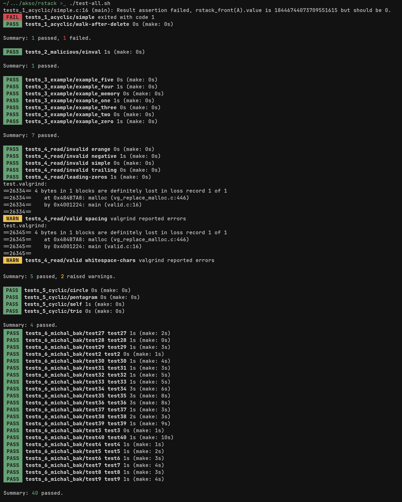

# Testerka do librstack.so


## Instalacja:
1. Wszystkie pliki umieść w korzeniu swojego projektu
> Oczywiście można pominąć README.md oraz preview.png
2. Do swojego makefile'a dopisz następujące cele
```
TEST_BATCH ?= test
test_%.o: ./tests_$(TEST_BATCH)/%.c macros.h
	$(CC) tests -c $< -o $@ $(CFLAGS)
test_%_executable: test_%.o librstack.so
	$(CC) $^ -o $@ -L . -lrstack
```
3. Zachęcam do uwzględnienia następujących plików w celu `clean` oraz
   pliku `.gitignore`:
```
test_*.fout test_*_executable test_*.o test.fout
test.diff test.stdout test.valgrind test.make
```

> Zamiast kroku pierwszego można sklonować repozytorium i zlinkować pliki
> programem gnu stow
> (komenda: `stow ŚCIEŻKA_DO_TESTOW -t ŚCIEŻKA_DO_PROJEKTU`)
> Następnie w celu `test_%.o` należy dopisać "-I ŚCIEŻKA_DO_TESTÓW/jakiś_folder").

# Użycie
Aby uruchomić wszystkie testy:
```
./test-all.sh
```

Aby uruchomić wszystkie testy z packi:
```
./test-batch.sh NAZWAPACZKI
```

Aby uruchomić pojedyńczy test:
```
./test.sh NAZWAPACZKI NAZWATESTU (NAZWAPRZYPADKU)
```
> Żeby skorzystać z domyślnego przypadku nie trzeciego argumentu.

Na początku skryptów `test.sh` i `test-batch.sh` znajdują się proste ustawienia
które można nadpisać.


## Testy
Każdy test jest reprezentowany przez osobnym programem w C i znajduje się w pliku:
```
tests_NAZWAPACZKI/NAZWATESTU.c.
```

Jeden test może mieć dowolną liczbę przypadków (test cases) w folderze:
```
tests_NAZWAPACZKI/NAZWATESTU/
```
albo jeden domyślny przypadek w tym samym folderze co kod źródłowy. W takiej
sytuacji nazwą przypadku jest nazwa testu.

## Przypadki
Każdy przypadek może mieć jeden z plików
- `NAZWAPRZYPADKU.args` - argumenty wywoływania programu
- `NAZWAPRZYPADKU.in` - tekst do wpisania na wejście standardowe
- `NAZWAPRZYPADKU.stdout` - tekst do porównania wyjścia standardowego
- `NAZWAPRZYPADKU.fout` - tekst do porównania wypisanego pliku `test.fout`
(makro OUTPUT_FILE)

Ponadto przypadek może także generować dowolną liczbę nazwanych plików wynikowych:
- `NAZWAPRZYPADKU_NAZWAPLIKU.fout` - plik porównywany z
`test_NAZWAPLIKU.fout` (makro TEST_FILE(nazwa))

# Autorzy testów
- tests_michal_bak - Michał Bąk
- tests_example - testy dołączone do treści zadania

Pozostałe testy zostały napisane przeze mnie - Ignacego Pękałę.

# Contributing
Zachęcam do dzielenia się swoimi testami oraz zgłaszania wszelkich usterek.
W obu przypadkach można otwierać issues lub pisać do mnie prywatnie.

