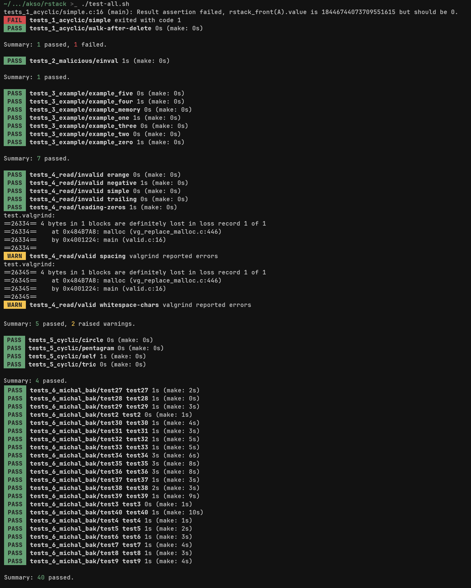

# Tests for rstack
Test framework for the librstack.so library with a collection of various tests.

## Features
- exit code check
- input formats: stdin, execution arguments
- standard output validation
- file output validation
- automatic compilation (GNU Make)
- valgrind memory checks



## Quickstart

### Installation
Clone this repository into a directory located at the root of your project.
```
git clone https://github.com/ignacypekala/rstack_tests ./rstack_tests
```

### Usage
First, navigate to the directory where the framework was cloned to:
```
cd rstack_tests
```
#### Running

- the entire test suite

    ```
    ./test-all.sh
    ```

- a specific batch

    ```
    ./test-batch.sh BATCHNAME
    ```

- a specific test

    ```
    ./test.sh BATCHNAME TESTNAME [CASENAME]
    ```
    > In order to run the default test case, omit the third argument.

Scripts `test.sh` and `test-batch.sh` can be configured with some of the following settings set at the beginning:

- COLORS: print a colored output
- COMPILE: compile the code by running make
- VALGRIND: perform memory checks with Valgrind
- VALGRIND_TRACK_ORIGINS: use the --track-origins valgrind flag

## Test Structure

### Test
Every test is represented by a separate C program under:
```
tests_BATCHNAME/TESTNAME.c.
```

A test can consist of multiple test cases, which may differ in input and
expected output, but share the same source code. Files for test cases
should be under:
```
tests_BATCHNAME/TESTNAME/
```

If no test cases are specified, the default test case is assumed, and
its input file should be stored alongside the source code.

### Cases
Every case (including the default case) may contain at most one of the following files:
- `CASENAME.args` - arguments passed to the executed program
- `CASENAME.in` - input passed to the program via stdin
- `CASENAME.stdout` - expected output on stdout
- `CASENAME.fout` - expected output in file specified by the
`OUTPUT_FILE` macro defined in macros.h

On top of that, every case may also generate an arbitrary number of named output
files. New file names may be acquired from the `TEST_FILE(name)` macro. These
will be compared with the corresponding:

- `CASENAME_FILENAME.fout` files

## Authors
This repository contains a test suite consisting of manual tests written by me
and external tests ported to the format required by the framework. The external
tests are:

- `tests_6_michal_bak` - author: Michał Bąk
- `tests_3_example` - tests provided with the assignment

Finally, files `memory_tests.c`, `memory_tests.h` and `rstack.h` were copied
from the assignment description, while `macros.h` is a modified version of the
provided corresponding file (not included here).

## License
The original code in this test framework is open-source and available under the [MIT License](./LICENSE). 

However, please note the following exceptions for files that were
provided by the assignment or external authors, which retain their
original attribution and copyright:

* `tests_6_michal_bak/`: Authored by Michał Bąk.
* `tests_3_example/`: Tests provided with the assignment description.
* `memory_tests.c`, `memory_tests.h`, and `rstack.h`: Copied directly from the assignment description.
* `macros.h`**: A modified version of the file provided with the assignment.

## Attribution
Finally, I'd like to give a massive thank you to Michał Bąk for creating and sharing the
exhaustive programmatically generated test suite and letting me port it
to this framework.
